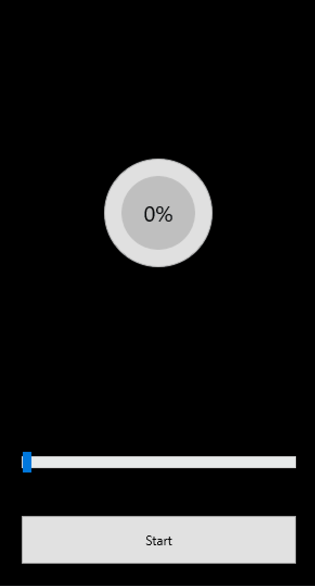
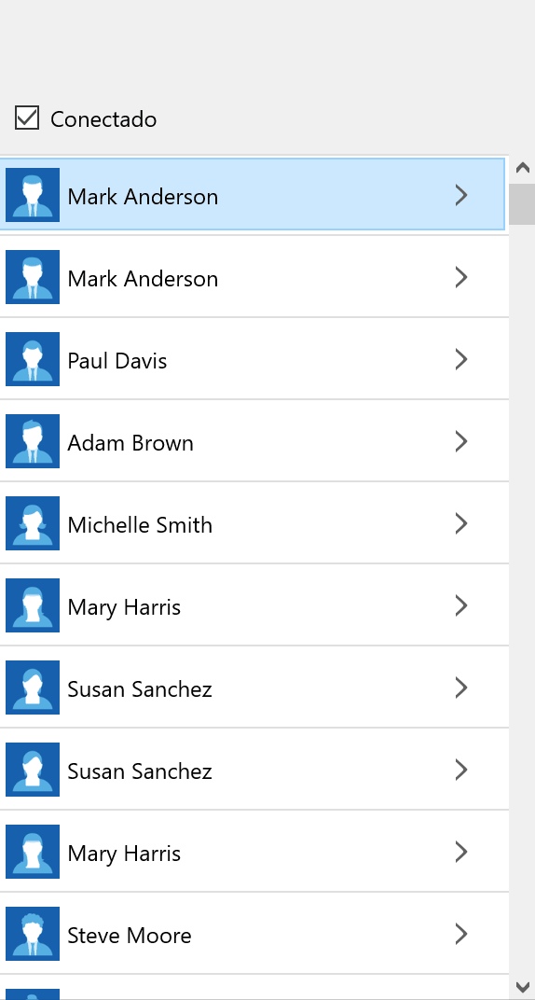
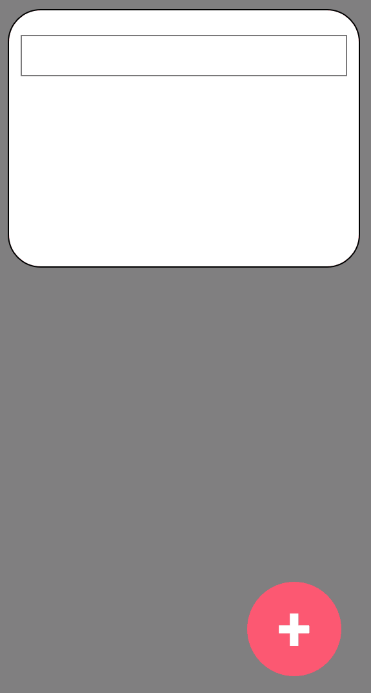

# Delphi Samples
Repositório com vários exemplos de código em FMX e VCL

***

## Rodando os projetos
Projetos atualizados para rodar com a versão RAD Studio 10.4.

***

### ActionSheet
Modal criado com FMX que apresenta um conujunto de ações que podem ser realizadas pelo usuário.

<h1 align="center">
    
</h1>

***

### Bitmap Fro URL
Componente criado com FMX que carrega a imagem a partir de uma URL.

<h1 align="center">
    
</h1>

***

### Color Move Animation
Exemplo de utilização do ColorAnimator

<h1 align="center">
    
</h1>

***

### Drop Down Menu
Menu criado com FMX que exibe itens de menu no formato dropdown.

<h1 align="center">
    
</h1>

***

### Dynamic List Grid
Grid criado com FMX que permite alternar itens em um formato grid para uma lista de itens.

<h1 align="center">
    
</h1>

***

### Progress Circle
Progress Indicator criado com FMX que exibe o percentual de conclusão.

<h1 align="center">
    
</h1>

***

### Wifi Status Bar
Componente que permite exibir o status de Wifi de dispositivo sempre que houver uma alteração de status de conexão.

<h1 align="center">
    
</h1>

***

### WorkFlow
Componente criado com FMX para apresentar fluxos que tenham status de conclusão por etapas.

<h1 align="center">
    
</h1>

***

### FloatingButton
Floating Button criado com FMX

<h1 align="center">
    
</h1>

***

### Base64 Converter
Exemplo de conversão de Imagem -> Base64 e Base 64 -> Imagem. 

<h1 align="center">
    
</h1>

***

### Android Calendar Manager
Exemplo de utilização da classe TCalendarEventsManager.

***

### Shell Execute
Exemplo de utilização do comando ShellExecute do VCL.

***

### WhatsApp Share
Exemplo de utilização do share do Android/iOS do FMX.

***

### Word Structure View
Projeto que permite visualizar as tags estruturais do XML de estrutura de um arquivo .word.

***

